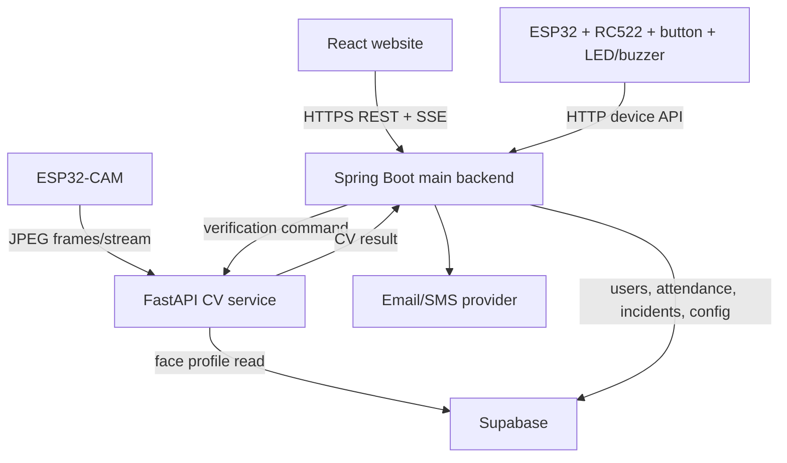

# System Architecture

## Architecture Diagram

## Component Boundaries

| Component | Responsibilities | Restrictions |
|---|---|---|
| React | UI for proctors, monitoring, history, reports. | Cannot write attendance directly; cannot hold service key; cannot calculate late status. |
| ESP32 | Read RFID/button, send to Spring Boot, control LED/buzzer. | Cannot decide if UID is valid or write attendance. |
| ESP32-CAM | Capture and send frames to FastAPI. | Cannot perform face validation. |
| FastAPI | Liveness detection, face matching against expected user, return result. | Cannot write attendance or decide late status. |
| Spring Boot | Auth, session orchestration, attendance, late calculation, CRUD, reports. | Cannot trust CV results missing session metadata. |
| Supabase | PostgreSQL DB, stores users, attendance, profiles, settings. | Do not expose service-role key to React. |

## Failure Behavior
- If React goes down, the system continues to process physical attendance.
- If FastAPI goes down, RFID scans will fail since face verification cannot proceed (Returns `CAMERA_OFFLINE` or similar).
- If Supabase goes down, Spring Boot will fail to record attendance and will reject physical scans, returning a `CLOUD_WRITE_FAILED` error.
- If ESP32 is offline, physical attendance is halted.
