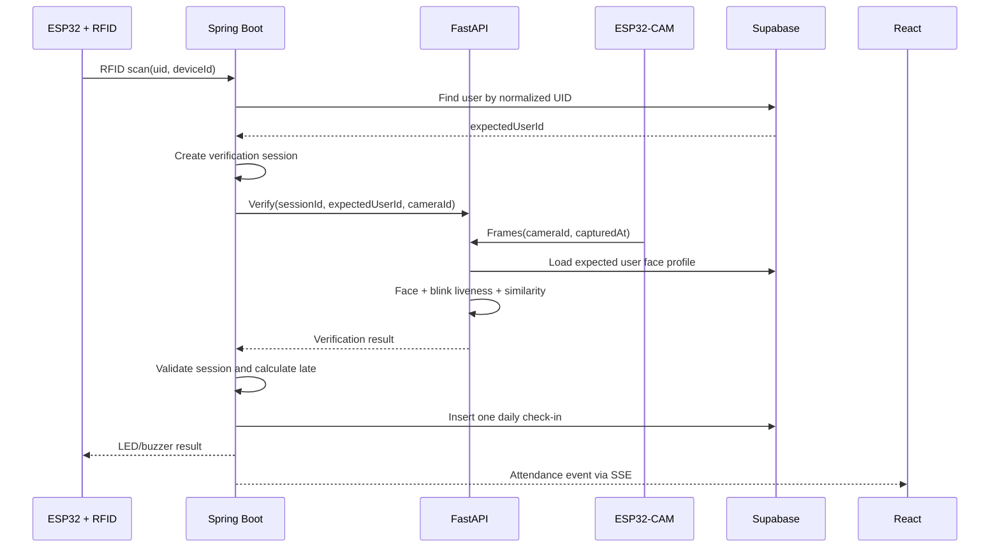
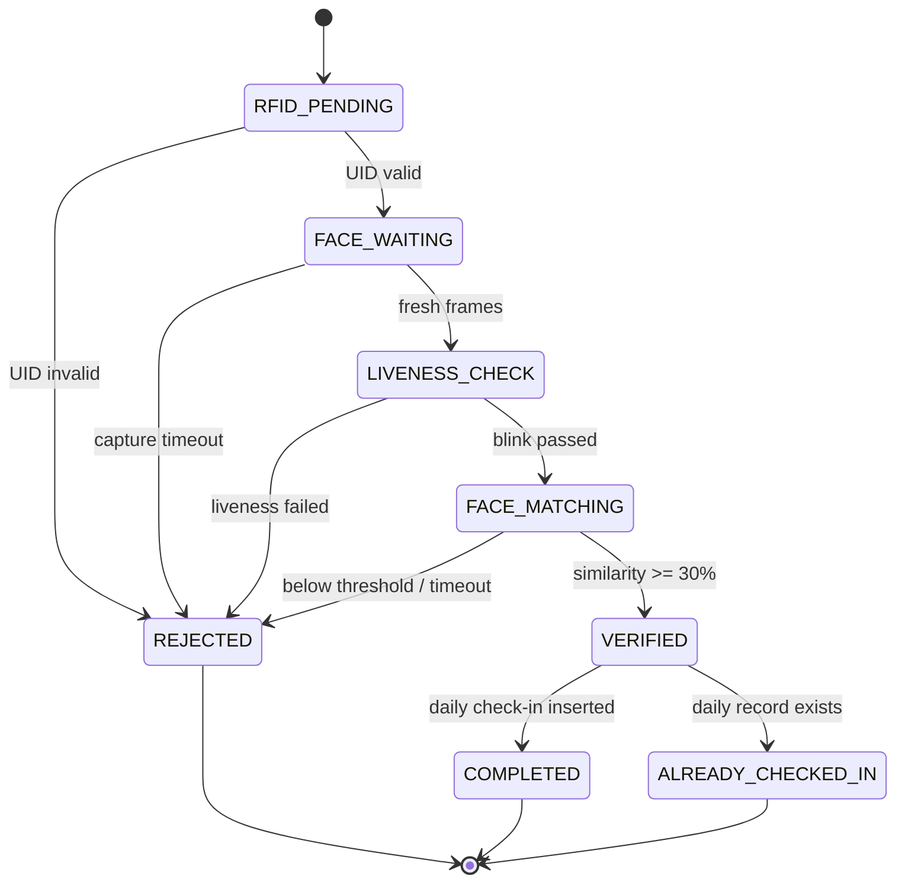

# Check-In Sequence

## 1. Sequence Diagram



## 2. State Machine



## 3. Timeout Rules
- **Capture/Liveness Window:** 10,000 ms. If no valid face or blink is detected, return `CAPTURE_TIMEOUT`.
- **Matching Timeout:** 5,000 ms after valid frame/liveness. If processing takes too long, return `FACE_MATCH_TIMEOUT`.
- Total theoretical maximum time: 15,000 ms.

## 4. Late Calculation
```text
timezone = Asia/Ho_Chi_Minh
cutoff   = 07:30:00

if localCheckInTime <= 07:30:00:
    status = ON_TIME
    lateMinutes = 0
else:
    status = LATE
    lateMinutes = ceil((localCheckInTime - 07:30:00) / 60 seconds)
```
Spring Boot handles this entirely. ESP32, React, and FastAPI do not calculate late status.
